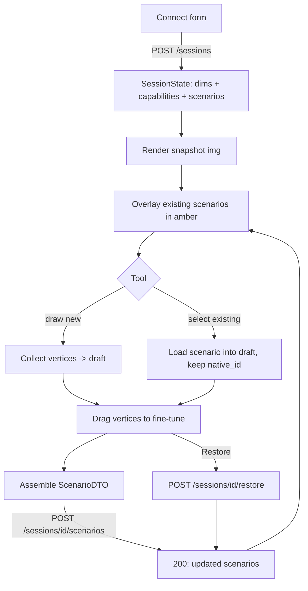

# Writer Canvas — Browser-Side Data Flow

Frontend sketch for the analytics-writer canvas described in `writer-api-spec.md`.
Framework-agnostic; pseudocode is plain JS. The whole point: **the canvas only
collects vertices in `[0,1]` fractions and POSTs a `ScenarioDTO`.** No geometry
math leaves the browser except fractions.

## The one coordinate rule
Everything is stored in **`[0,1]` top-left fractions** (same as `ScenarioDTO.points`).
Pixels exist *only* for rendering and hit-testing, derived from the image's
current on-screen size:

```js
// display <-> storage. renderedW/H = the /<canvas> size on screen right now.
const toPx  = ([fx, fy]) => [fx * renderedW, fy * renderedH];
const toFrac = ([px, py]) => [clamp01(px / renderedW), clamp01(py / renderedH)];
```

Because storage is fractional, **window resize / zoom needs no data migration** —
re-render with the new `renderedW/H` and every point lands correctly. Never
persist pixels.

## State shape
```js
state = {
  session: { id, vendor, imageW, imageH, capabilities },   // from POST /sessions
  snapshotUrl,                                              // GET /sessions/{id}/snapshot
  scenarios: [ScenarioDTO, ...],                            // existing, read-only overlay
  draft: null | {
    name, kind,                 // kind gated by capabilities.kinds
    points: [[fx,fy], ...],     // being drawn / edited
    classes: ["human"],         // gated by capabilities.classes / multi_class
    duration, direction,        // per-kind fields
    exclusions: [[...], ...],   // only if capabilities.exclusions
    native_id: null | id,       // null = create; set = edit-in-place
  },
  tool: "select" | "intrusion" | "line" | "loiter" | "exclude",
  grabbed: null | { target: "draft"|"exclusion", zoneIdx, vertexIdx },
}
```

## Lifecycle



## Interactions

**Load.** `POST /sessions` → render `snapshotUrl` into an ``, size a transparent
`<canvas>` on top of it, draw `state.scenarios` as amber overlays. Read
`capabilities` to build the toolbar — disable tools not in `capabilities.kinds`,
hide the exclusion tool unless `capabilities.exclusions`, disable delete unless
`capabilities.can_delete`.

**Draw new (polygon: intrusion / loiter).** Click adds a vertex to `draft.points`
(store `toFrac(clickPx)`). Click near the first vertex (within N px) closes the
polygon. Line crossing: exactly 2 points + a direction toggle. Loiter: polygon +
a duration input.

**Drag to fine-tune (the shipped draggable-vertices UX).** On `mousedown`,
hit-test each drawn vertex in pixel space (`dist(mousePx, toPx(v)) < grabRadius`);
set `state.grabbed`. On `mousemove`, rewrite that one point to `toFrac(mousePx)`
and redraw. On `mouseup`, clear `grabbed`. Same handler covers exclusion-zone
vertices via `grabbed.target`.

**Edit existing.** Click a rendered scenario in `select` mode → deep-copy it into
`state.draft`, **carry its `native_id`**. Now the same drag/redraw path edits it;
on submit the server patches in place (preserves Axis perspective/presets/filters)
instead of creating a duplicate.

**Submit.** Assemble the DTO straight from `draft` and POST:
```js
async function applyDraft() {
  const dto = {
    name: draft.name, kind: draft.kind, points: draft.points,
    classes: draft.classes, duration: draft.duration ?? 0,
    direction: draft.kind === "line" ? draft.direction : null,
    exclusions: capabilities.exclusions ? draft.exclusions : [],
    native_id: draft.native_id,           // null => create
  };
  const res = await fetch(`/api/writer/sessions/${session.id}/scenarios`, {
    method: "POST", headers: {"Content-Type": "application/json"},
    body: JSON.stringify(dto),
  });
  if (res.status === 422) return showValidationError(await res.json());  // vendor can't do this
  state.scenarios = (await res.json()).scenarios;   // authoritative refresh
  state.draft = null;
}
```

**Backup / restore / refresh.** "Restore" → `POST /restore` with a `backup_id` from
`GET /backups`; replace `state.scenarios` with the response. "Refresh snapshot" →
re-`GET /snapshot` (cache-bust the URL).

## Client-side validation vs server-side
Keep the client checks to fast UX guards only; the server is authoritative:

| Check | Where |
|---|---|
| Min vertices (polygon ≥3, line =2) | client (disable submit) |
| Tool/class allowed for vendor | client (from `capabilities`) — server re-checks via `_require` → **422** |
| Self-intersecting polygon, geometry sanity | **server** (`validate_scenario`) — surface the 422 message |
| `native_id` still exists | server |

Don't reimplement `validate_scenario` in JS — mirror only what makes the toolbar
feel responsive, and render the server's 422 message verbatim.

## Gotchas
- **Aspect ratio.** Letterbox the canvas to `imageW:imageH`; if the container
  aspect differs, fractions still map correctly *only* if `renderedW/H` are the
  image's actual drawn box, not the container. Measure the `` content box.
- **One draft at a time.** Starting a new draw or selecting another scenario with
  an unsaved `draft` should prompt — the server only sees what you POST.
- **Amber = committed, accent = draft.** Match the desktop writer's convention so
  users can tell live config from unsaved edits.
- **Lease awareness.** If `POST /sessions` 409s, another user holds the camera —
  show who/when rather than silently failing.
